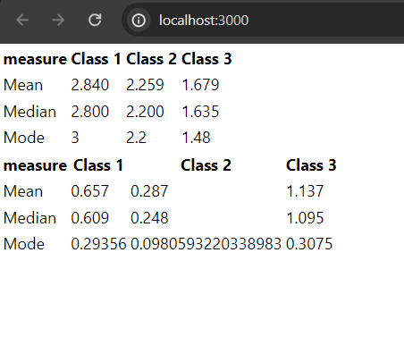

# WineDataSet

## Installation

For Module Installations
<code>
npm install
</code>  

for start App: 
<code>
npm start
</code>  

## Folder Structure

<ul>
</ul>

src:---  
*  components/: Contains React components.  
* utils/: Utility functions and data fetching. 
* App.jsx: Main application component.  

## Calculations
### Flavanoids Table

Measure: Flavanoids 
Mean: Calculated as the average of the values. 
Median: The middle value of the sorted dataset. 
Mode: The most frequently occurring value. 
### Gamma Table
Measure: Gamma 
Mean: Calculated as the average of the values. 
Median: The middle value of the sorted dataset. 
Mode: The most frequently occurring value. 

